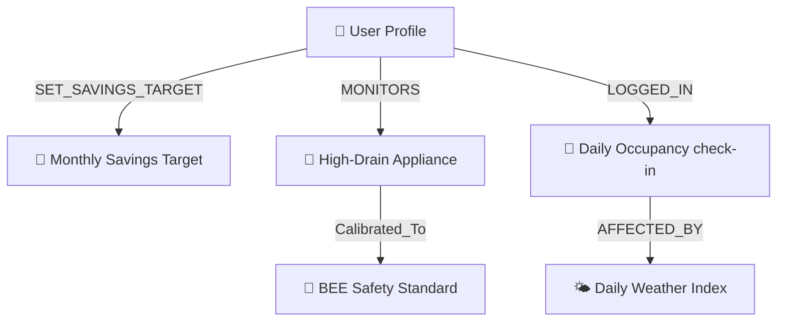

# ⚡ Voltify
### *The Cognee-Powered Home Energy Memory Platform*

🏆 **Built for the WeMakeDevs x Cognee "The Hangover Part AI" Hackathon**

---

## 🧠 The Vision: We Gave a Home a Memory

Most energy apps are static dashboards operating in feature silos. **Voltify** is different. We wrapped the **entire backend architecture around Cognee Cloud** to establish a unified, long-term cognitive memory layer. 

Every utility bill parsed, every temperature fluctuation, every daily occupancy check-in, and every chat interaction becomes part of that household’s evolving knowledge graph. The result isn't just a smarter chatbot—it’s a platform where the Dashboard, Home DNA, Evolution Timeline, and AI Coach (**Volt**) share the same memory context to learn, adapt, and explain energy decisions over time.

---

## 🛠️ How We Integrated Cognee Cloud

Voltify leverages Cognee's hosted graph-vector database endpoints end-to-end to manage the cognitive memory lifecycle of the household:

```
                  ┌─────────────────────────────────┐
                  │          Cognee Cloud           │
                  └────────────────┬────────────────┘
                                   │
         ┌─────────────────────────┼─────────────────────────┐
         ▼                         ▼                         ▼
   remember()                  recall()                  improve()
 Ingests check-ins,         Retrieves graph context   Consolidates sessions
 utility bill OCR details,  to ground Volt buddy      into long-term habits
 & chat messages.           and dashboard insights.   via background /cognify.
```

### 1. `remember()` – Ingesting Context
Whenever a user interacts with the app (daily check-ins, utility uploads, or chat dialogues), the backend registers these facts using the Cognee remember endpoint, mapping them to the user's specific dataset:
```javascript
// Ingesting user check-ins or preferences into Cognee Cloud
await callCogneeAPI('POST', '/remember', {
  datasetName: `user_${userId}`,
  session_id: sessionId,
  data: [ { text: `Occupancy: ${occupancyDetails}, AC state: ${acTempPreference}°C` } ]
});
```

### 2. `recall()` – Grounding the Chatbot and Dashboard
When the user queries the AI coach (**Volt**) or checks dashboard insights, Voltify uses `recall()` with `GRAPH_COMPLETION` search to retrieve semantically matching node connections:
```javascript
// Querying graph memory restricted strictly to the user's dataset
const res = await callCogneeAPI('POST', '/recall', {
  query: userQuery,
  datasets: [`user_${userId}`],
  searchType: 'GRAPH_COMPLETION'
});
```

### 3. `improve()` – Consolidating Long-Term Habits
After chat exchanges, Voltify runs the `/cognify` engine in the background to structure short-term context into high-confidence permanent habits:
```javascript
// Restructuring the graph schema based on cumulative actions
await callCogneeAPI('POST', '/cognify', {
  datasets: [`user_${userId}`],
  run_in_background: false
});
```

### 4. `forget()` – Surgical Profile Reset
Under Settings, if the user wishes to clear their profile, Voltify deletes their dataset permanently from Cognee Cloud:
```javascript
// Surgical user memory deletion
await callCogneeAPI('DELETE', '/datasets', {
  dataset_name: `user_${userId}`
});
```

---

## 📐 Ontological Graph Architecture

Voltify maps the household parameters using an ontological node structure:



*   **Nodes:** `UserProfile`, `SavingsTarget`, `ApplianceDetails`, `CheckInLogs`, `WeatherIndex`.
*   **Relationships:** `SET_SAVINGS_TARGET`, `MONITORS`, `Calibrated_To`, `AFFECTED_BY`.
*   **Behavior Synthesis:** Over time, repetitive actions (e.g. ignoring a 24°C suggestion 6 times, accepting 23°C 4 times) consolidate into a high-confidence relation (`User prefers 23°C for sleep comfort`).

---

## ⚡ Key Voltify Features

### 📊 Dashboard & Estimated Savings
*   **Weather-Calibrated Disaggregation:** Calibrates daily baseline curves using local weather indices (e.g., AC +5% consumption per 1°C temperature increase above 24°C).
*   **BEE/WHO Safety Guardrails:** Restricts Comfort-Safe Savings (CSS) sliders within healthy thresholds (AC $\ge$ 24°C, Refrigerator $\ge$ 4°C) to prevent compromising household health.
*   **"Why?" Explainable AI:** Explainable widgets pull facts from Cognee memory to tell the user *why* specific schedules reduce bills.

### 🎮 Gamification & Streaks
*   **175 Coins Seeded Baseline:** Users earn coins by beating estimations and completing weekly challenges.
*   **Streak Multipliers:** Maintain consecutive daily check-ins to increase multiplier bonuses (1.15x → 1.60x).
*   **Fair Leaderboards:** Ranks families and bachelors separately based on savings ratios rather than total units saved, ensuring fairness.

---

## 🛠️ Tech Stack & Services

*   **Frontend:** React 19, TypeScript, Tailwind CSS, Zustand, Recharts, Framer Motion.
*   **Backend:** Node.js, Express, JWT, PostgreSQL (Supabase Connection Pooler).
*   **AI Models:** Groq API (Llama 3.3 70B), Cognee Cloud (Graph-Vector Memory Engine).
*   **APIs:** WeatherAPI (live weather calibration), unpdf (Tesseract bill OCR statement ingestion).

---

## ⚙️ Getting Started & Testing

### 1. Clone & Set Up Backend env
Navigate to the `voltify-backend` directory, run `npm install`, and configure `.env`:
```env
PORT=5000
DATABASE_URL=postgresql://...  # Supabase connection pooler string (Port 6543)
JWT_SECRET=your_jwt_secret
CORS_ORIGIN=https://vltify.vercel.app  # Or local frontend URL
GROQ_API_KEY=your_groq_key
COGNEE_API_KEY=your_groq_key # if sharing key, or tenant API key
```

### 2. Set Up Frontend env
Navigate to the `voltify-frontend` directory, run `npm install`, and configure `.env`:
```env
VITE_API_URL=http://localhost:5000/api
```

### 3. Verify Live Demo Account
*   **Email:** `demo@voltify.com`
*   **Access:** Dynamically seeds the 8-month historical story. Open the AI Coach to test long-term memory recall live!